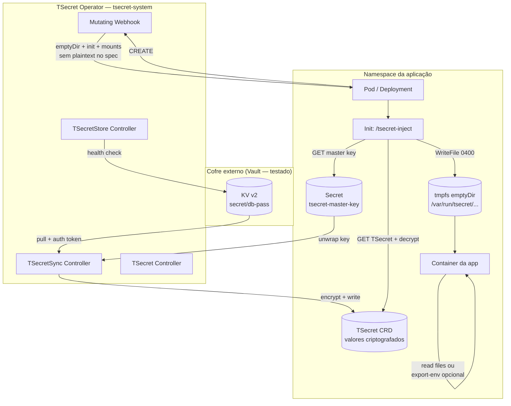
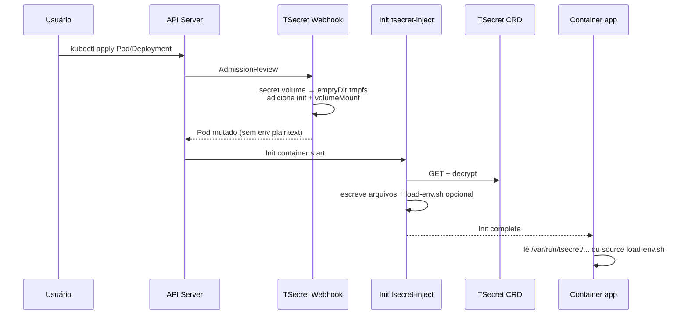

# TSecret (True Secret)

[](LICENSE)

Operador Kubernetes para gerenciamento de secrets com **criptografia real em repouso**, sincronização opcional a cofres externos e **injeção em runtime** via webhook + init container — sem gravar valores decriptados no spec do Pod.

> **Status:** `v1alpha1` — projeto em estágio inicial. Cofre externo **validado em laboratório apenas com HashiCorp Vault**. Providers AWS, Azure, GCP e Oracle existem no código, mas **não foram testados end-to-end** neste repositório.

---

## O problema

| Situação | Limitação |
|----------|-----------|
| `Secret` nativo do Kubernetes | Valor é apenas base64 no etcd; quem tem RBAC de leitura vê o conteúdo |
| External Secrets Operator | Materializa `Secret` Kubernetes em plaintext no cluster |
| Criptografia no app | Cada aplicação precisa implementar decriptação, rotação e bootstrap de chaves |
| Injeção via env no spec | Valores decriptados ficam persistidos no objeto Pod (etcd, backups, audit logs) |

## O que o TSecret resolve

1. **Armazena secrets criptografados** no CRD `TSecret` (XChaCha20-Poly1305 / ChaCha20-Poly1305).
2. **Sincroniza de cofres externos** (`TSecretSync` → `TSecret`) sem criar `Secret` Kubernetes nativo.
3. **Injeta no Pod em runtime** via init container (`/tsecret-inject`): arquivos em **tmpfs (memória)**, não no `spec.containers[].env`.
4. **Export opcional de env** via annotations — carrega variáveis no processo sem persistir valores no spec.

---

## Fluxo end-to-end



### Injeção no Pod (detalhe)



---

## Árvore de recursos

```
Cluster
├── CRDs (cluster-scoped definitions)
│   ├── tsecrets.tsecret.io
│   ├── tsecretstores.tsecret.io
│   ├── clustertsecretstores.tsecret.io
│   └── tsecretsyncs.tsecret.io
│
├── Namespace: tsecret-system
│   ├── Deployment: tsecret-operator
│   ├── Service: tsecret-webhook
│   ├── ServiceAccount + ClusterRole(Binding)
│   ├── Secret: tsecret-webhook-certs
│   ├── Secret: tsecret-ca
│   └── MutatingWebhookConfiguration
│       └── namespaceSelector: tsecret.io/inject=enabled
│
└── Namespace: <app>  (ex.: default, tsecret-test)
    ├── Label no Namespace: tsecret.io/inject=enabled
    │
    ├── Secret: tsecret-master-key          ← chave simétrica (32 bytes)
    │
    ├── TSecretStore: vault-backend         ← conexão Vault (testado)
    │   └── auth.tokenSecretRef → vault-token
    │
    ├── TSecretSync: db-pass-sync           ← Vault → TSecret
    │   └── target → TSecret abaixo
    │
    ├── TSecret: db-credentials             ← dados criptografados no etcd
    │   └── spec.data.*.value (ciphertext)
    │
    ├── ServiceAccount: tsecret-workload    ← RBAC get tsecrets + secrets
    ├── Role + RoleBinding
    │
    └── Deployment/Pod
        ├── volume: secret → mutado p/ emptyDir (Memory)
        ├── initContainer: tsecret-init-*  → /tsecret-inject
        └── container: volumeMount /var/run/tsecret/<nome>/
            └── arquivos: DB_PASSWORD, DB_PASSWORD2, load-env.sh (opcional)
```

---

## CRDs

| CRD | Escopo | Função |
|-----|--------|--------|
| `TSecret` | Namespace | Armazena pares chave→valor **criptografados** |
| `TSecretStore` | Namespace | Configura provider de cofre externo + health check |
| `ClusterTSecretStore` | Cluster | Mesmo que `TSecretStore`, visível cluster-wide |
| `TSecretSync` | Namespace | Puxa secrets do cofre → criptografa → grava/atualiza `TSecret` |

### Formato do ciphertext (`TSecret`)

```
tsecret:<algorithm>:<nonce_b64>:<ciphertext_b64>
```

Algoritmos suportados: `xchacha20-poly1305` (recomendado), `chacha20-poly1305`. AES **não** é suportado (risco de side-channel sem AES-NI).

---

## Componentes do operador

| Componente | Responsabilidade |
|------------|------------------|
| `TSecretReconciler` | Valida formato criptografado; status `Ready` |
| `TSecretStoreReconciler` | Health check periódico do provider |
| `TSecretSyncReconciler` | Sync cofre → `TSecret` (all-or-nothing por reconcile) |
| **Mutating Webhook** | Estrutura o Pod: tmpfs + init; **não decripta** |
| **`/tsecret-inject`** | Init container: decripta em runtime e escreve arquivos |
| **CertManager** | TLS auto-assinado para webhook (estilo Kyverno) |

---

## Início rápido

### 1. Instalar CRDs e operador

```bash
kubectl apply -f config/crd/
kubectl apply -f config/deploy/
```

Habilitar injeção no namespace da app:

```bash
kubectl label namespace default tsecret.io/inject=enabled --overwrite
```

### 2. Master key (bootstrap)

```bash
KEY=$(openssl rand -base64 32 | head -c 32)
kubectl create secret generic tsecret-master-key \
  --from-literal=encryption-key="$KEY" \
  -n default
```

### 3. Vault — TSecretStore (testado)

```yaml
apiVersion: tsecret.io/v1alpha1
kind: TSecretStore
metadata:
  name: vault-backend
  namespace: default
spec:
  provider:
    vault:
      server: "http://vault.vault.svc.cluster.local:8200"
      path: "secret"          # mount KV v2 — NÃO incluir /data
      auth:
        tokenSecretRef:
          name: vault-token
          key: token
  refreshInterval: "60s"
```

```bash
# No Vault (KV v2)
vault kv put secret/db-pass value='minha-senha'
vault kv put secret/db-pass2 value='outra-senha'
```

> O operador monta o path interno como `{path}/data/{key}` → `secret/data/db-pass`.

### 4. TSecretSync

```yaml
apiVersion: tsecret.io/v1alpha1
kind: TSecretSync
metadata:
  name: db-pass-sync
  namespace: default
spec:
  secretStoreRef:
    name: vault-backend
    kind: TSecretStore
  target:
    name: db-credentials
  data:
    - secretKey: DB_PASSWORD
      remoteRef:
        key: db-pass
        property: value
    - secretKey: DB_PASSWORD2
      remoteRef:
        key: db-pass2
        property: value
  refreshInterval: "30s"
```

### 5. RBAC do workload

O init container lê `TSecret` e `tsecret-master-key` com o ServiceAccount do Pod:

```bash
kubectl apply -f config/samples/tsecret.yaml   # inclui Role tsecret-workload
```

### 6. Usar no Deployment (recomendado: volume)

```yaml
apiVersion: apps/v1
kind: Deployment
metadata:
  name: my-app
  namespace: default
spec:
  template:
    spec:
      serviceAccountName: tsecret-workload
      containers:
        - name: app
          image: my-app:latest
          volumeMounts:
            - name: secrets
              mountPath: /var/run/tsecret/db-credentials
              readOnly: true
      volumes:
        - name: secrets
          secret:
            secretName: db-credentials   # referencia TSecret, não Secret K8s
```

Leitura no container:

```bash
cat /var/run/tsecret/db-credentials/DB_PASSWORD
```

Exemplo completo: [`config/samples/nginx-tsecret-inject.yaml`](config/samples/nginx-tsecret-inject.yaml)

---

## Export opcional de variáveis de ambiente

Por padrão, valores **não** aparecem em `spec.containers[].env`. Para exportar env **no runtime** (sem plaintext no spec):

```yaml
metadata:
  annotations:
    tsecret.io/export-env: "true"                    # ou tsecret.io/export-env.nginx
    tsecret.io/entrypoint.nginx: /docker-entrypoint.sh nginx -g 'daemon off;'
```

O init grava `load-env.sh`; o webhook encapsula o entrypoint:

```sh
set -a; . /var/run/tsecret/db-credentials/load-env.sh; set +a; exec <entrypoint>
```

| Annotation | Escopo | Descrição |
|------------|--------|-----------|
| `tsecret.io/export-env` | Pod | Habilita export em containers com TSecret |
| `tsecret.io/export-env.<container>` | Container | Export só naquele container |
| `tsecret.io/entrypoint` | Pod | Comando após carregar env |
| `tsecret.io/entrypoint.<container>` | Container | Entrypoint específico |

**Atenção:** apps que fazem `exec` e limpam o ambiente (ex.: nginx como PID 1) podem **não** exibir env em `/proc/1/environ`. Nesses casos, prefira leitura por arquivo ou scripts que façam `source load-env.sh`.

---

## Referências suportadas no Pod

| Referência no YAML | Comportamento |
|--------------------|---------------|
| `volumes[].secret.secretName` | **Recomendado** — tmpfs + arquivos |
| `envFrom.secretRef` | Convertido para volume + mount |
| `env.valueFrom.secretKeyRef` | Convertido para volume + mount |

Todas exigem que o nome aponte para um **TSecret** no mesmo namespace.

---

## Pontos de atenção

### Segurança

- **Master key** (`tsecret-master-key`): quem controla essa Secret controla todos os TSecrets do namespace. Proteja e rotacione com processo formal.
- **Valores decriptados** existem em **tmpfs** dentro do Pod em execução — visíveis a quem tem `exec` no container ou acesso ao nó (threat model padrão de secrets em memória).
- **Spec do Pod permanece limpo** — sem senhas em `env` nem scripts com literals no init; decriptação ocorre só no processo `/tsecret-inject`.
- **`failurePolicy: Fail`** — se o webhook ou init falhar, o Pod **não sobe** (fail-closed).
- **Webhook por namespace** — só namespaces com `tsecret.io/inject=enabled` são mutados.
- **Sync all-or-nothing** — se uma chave falhar no Vault, **nenhuma** chave é atualizada no `TSecret` alvo.
- **Health check do Vault** usa `/v1/sys/health` (sem auth) — store pode aparecer `Available` mesmo com token inválido; falhas aparecem no `TSecretSync`.

### Operacional

- **Vault KV v2:** use `path: "secret"` (mount), não `secret/data`.
- **Token Vault:** operador lê `tokenSecretRef` no sync; configure RBAC do SA do Pod para o init ler `TSecret` + master key.
- **Imagem do inject:** variável `TSECRET_INJECTOR_IMAGE` no operador (default `tsecret:latest`); mesma imagem contém `/manager` e `/tsecret-inject`.
- **Providers não testados:** AWS, Azure, GCP, Oracle — use com cautela até validação em ambiente real.

### Limitações conhecidas (`v1alpha1`)

- Auth Vault: apenas `tokenSecretRef` implementado (Kubernetes auth / AppRole planejados).
- Sem Helm chart oficial; manifests em `config/deploy/`.
- Sem CLI `tsecret encrypt` (roadmap).
- Rotação automática de chaves não implementada.

---

## Estrutura do projeto

```
TSecret/
├── cmd/
│   ├── manager/main.go       # Operador + webhook
│   └── inject/main.go        # Init container (/tsecret-inject)
├── pkg/
│   ├── apis/v1alpha1/        # CRD types
│   ├── controller/           # Reconcilers
│   ├── crypto/               # Encrypt / Decrypt
│   ├── inject/               # Escrita runtime em tmpfs
│   ├── providers/            # Vault, AWS, Azure, GCP, Oracle
│   ├── webhook/              # Mutação estrutural do Pod
│   └── certs/                # TLS do webhook
├── config/
│   ├── crd/
│   ├── deploy/               # RBAC, Deployment, Webhook
│   └── samples/              # Exemplos Vault, nginx, RBAC workload
├── Dockerfile                # manager + tsecret-inject
├── Makefile
└── go.mod
```

---

## Build e deploy local

```bash
make docker-build IMG=tsecret:latest

# kind (exemplo)
kind load docker-image tsecret:latest
kubectl apply -f config/crd/
kubectl apply -f config/deploy/
kubectl set env deployment/tsecret-operator -n tsecret-system \
  TSECRET_INJECTOR_IMAGE=tsecret:latest
```

Manifests de laboratório (namespace `tsecret-test`, Vault in-cluster):

```bash
kubectl create namespace tsecret-test
kubectl label namespace tsecret-test tsecret.io/inject=enabled --overwrite
kubectl apply -f examples/lab/
```

Arquivos em [`examples/lab/`](examples/lab/) — distintos dos samples genéricos em [`config/samples/`](config/samples/).

Variáveis do operador:

| Variável | Descrição |
|----------|-----------|
| `TSECRET_INJECTOR_IMAGE` | Imagem usada nos init containers |
| `POD_NAMESPACE` | Namespace do operador (downward API) |

---

## Roadmap

- [ ] Helm chart
- [ ] Rotação automática de chaves
- [ ] Métricas Prometheus
- [ ] CLI `tsecret encrypt`
- [ ] Vault Kubernetes auth / AppRole
- [ ] Testes E2E para AWS, Azure, GCP, Oracle
- [ ] Publicação GHCR (`ghcr.io/...`)

---

## Licença

Licensed under the Apache License, Version 2.0. See [LICENSE](LICENSE).
