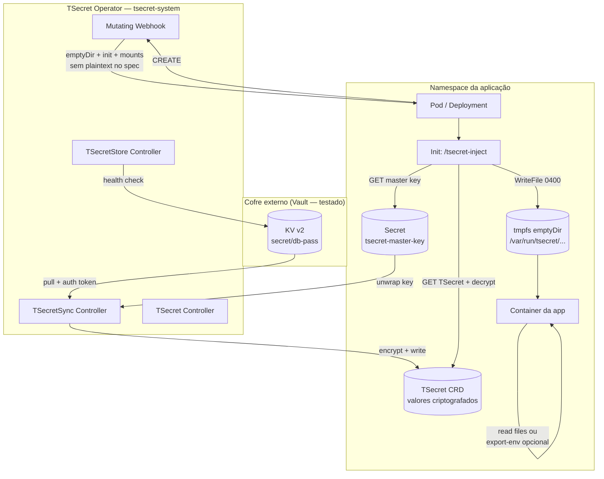
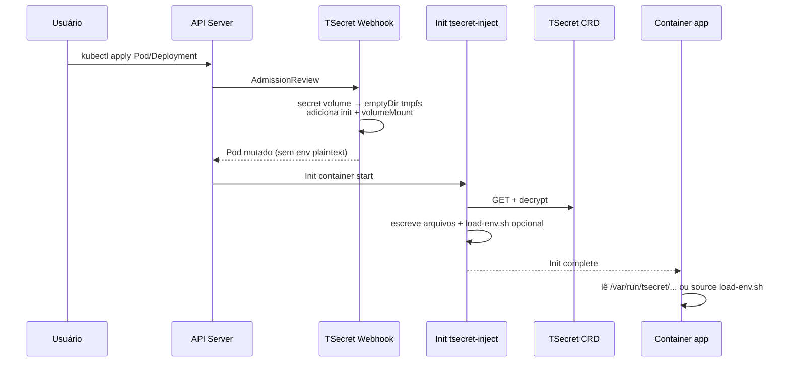
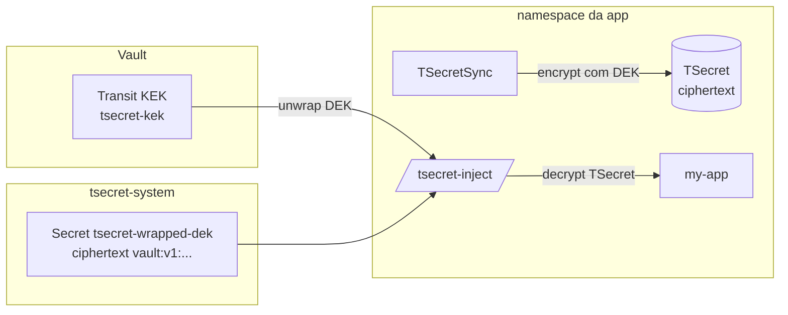

# TSecret (True Secret)

[](LICENSE)

Operador Kubernetes para gerenciamento de secrets com **criptografia real em repouso**, sincronização opcional a cofres externos e **injeção em runtime** via webhook + init container — sem gravar valores decriptados no spec do Pod.

> **Status:** `v1alpha1` — projeto em estágio inicial. **Vault KV v2 + Vault Transit** validados end-to-end em laboratório. Providers AWS, Azure, GCP e Oracle existem no código para secret stores, mas **não foram testados end-to-end** neste repositório.

---

## O problema

| Situação | Limitação |
|----------|-----------|
| `Secret` nativo do Kubernetes | Valor é apenas base64 no etcd; quem tem RBAC de leitura vê o conteúdo |
| External Secrets Operator | Materializa `Secret` Kubernetes em plaintext no cluster |
| Criptografia no app | Cada aplicação precisa implementar decriptação, rotação e bootstrap de chaves |
| Injeção via env no spec | Valores decriptados ficam persistidos no objeto Pod (etcd, backups, audit logs) |

## O que o TSecret resolve

1. **Armazena secrets criptografados** no CRD `TSecret` (XChaCha20-Poly1305 / ChaCha20-Poly1305).
2. **Sincroniza de cofres externos** (`TSecretSync` → `TSecret`) sem criar `Secret` Kubernetes nativo.
3. **Injeta no Pod em runtime** via init container (`/tsecret-inject`): arquivos em **tmpfs (memória)**, não no `spec.containers[].env`.
4. **Export opcional de env** via annotations — carrega variáveis no processo sem persistir valores no spec.
5. **Envelope encryption com Vault Transit** — DEK nunca em plaintext no cluster; KEK permanece no Vault.

---

## Fluxo end-to-end



### Injeção no Pod (detalhe)



---

## Árvore de recursos

```
Cluster
├── CRDs (cluster-scoped definitions)
│   ├── tsecrets.tsecret.io
│   ├── tsecretstores.tsecret.io
│   ├── clustertsecretstores.tsecret.io
│   └── tsecretsyncs.tsecret.io
│
├── Namespace: tsecret-system
│   ├── Deployment: tsecret-operator
│   ├── Service: tsecret-webhook
│   ├── ServiceAccount + ClusterRole(Binding)
│   ├── Secret: tsecret-webhook-certs
│   ├── Secret: tsecret-ca
│   └── MutatingWebhookConfiguration
│       └── namespaceSelector: tsecret.io/inject=enabled
│
└── Namespace: <app>  (ex.: default)
    ├── Label: tsecret.io/inject=enabled
    │
    ├── [Transit] Secret: tsecret-wrapped-dek  ← em tsecret-system (só ciphertext)
    ├── [Lab]     Secret: tsecret-master-key   ← 32 bytes plaintext (namespace da app)
    │
    ├── TSecretStore: vault-backend
    ├── TSecretSync: db-pass-sync → TSecret db-credentials
    ├── ServiceAccount: tsecret-workload + RBAC
    └── Deployment my-app → /var/run/tsecret/db-credentials/
```

---

## CRDs

| CRD | Escopo | Função |
|-----|--------|--------|
| `TSecret` | Namespace | Armazena pares chave→valor **criptografados** |
| `TSecretStore` | Namespace | Configura provider de cofre externo + health check |
| `ClusterTSecretStore` | Cluster | Mesmo que `TSecretStore`, visível cluster-wide |
| `TSecretSync` | Namespace | Puxa secrets do cofre → criptografa → grava/atualiza `TSecret` |

### Formato do ciphertext (`TSecret`)

```
tsecret:<algorithm>:<nonce_b64>:<ciphertext_b64>
```

Algoritmos suportados: `xchacha20-poly1305` (recomendado), `chacha20-poly1305`. AES **não** é suportado (risco de side-channel sem AES-NI).

### Gerenciamento de chaves (`encryptionRef`)

O `TSecret` e o `TSecretSync` referenciam como os valores são cifrados via `spec.encryptionRef`:

| Provider | Uso | Master key no cluster | Status |
|----------|-----|----------------------|--------|
| `sealed-secret` | Lab / bootstrap rápido | `Secret` com `encryption-key` em plaintext (32 bytes) | ✅ Testado |
| `vault-transit` | **Recomendado para produção** | Apenas DEK **embrulhada** (`vault:v1:...`) em `tsecret-system` | ✅ Testado E2E |

#### Modo bootstrap (`sealed-secret`)

```bash
kubectl create secret generic tsecret-master-key \
  --from-literal=encryption-key="$(openssl rand -base64 32 | head -c 32)" \
  -n default
```

Quem tem `get secrets` no namespace da app **pode ler a chave mestra** e decriptar todos os `TSecret` daquele namespace.

#### Modo Vault Transit (`vault-transit`) — envelope encryption



1. **KEK** (Key Encryption Key) vive no **Vault Transit** — nunca sai do Vault.
2. **DEK** (Data Encryption Key, 32 bytes) é gerada no bootstrap e **embrulhada** pelo Transit.
3. No cluster existe só `tsecret-system/tsecret-wrapped-dek` com `ciphertext: vault:v1:...`.
4. No sync e no init, o operador/inject chama `transit/decrypt` para obter a DEK em memória e cifrar/decifrar os valores do `TSecret`.

Exemplo de `encryptionRef` no `TSecretSync`:

```yaml
encryptionRef:
  provider: vault-transit
  name: tsecret-kek                    # nome da chave no Transit
  vaultTransit:
    storeRef:
      name: vault-backend
      kind: TSecretStore
    wrappedKeySecret:
      name: tsecret-wrapped-dek
      key: ciphertext
      namespace: tsecret-system
```

Bootstrap (uma vez por cluster):

```bash
bash config/deploy/bootstrap-vault-transit.sh
```

---

## Componentes do operador

| Componente | Responsabilidade |
|------------|------------------|
| `TSecretReconciler` | Valida formato criptografado; status `Ready` |
| `TSecretStoreReconciler` | Health check periódico do provider |
| `TSecretSyncReconciler` | Sync cofre → `TSecret` (all-or-nothing por reconcile) |
| **Mutating Webhook** | Estrutura o Pod: tmpfs + init; **não decripta** |
| **`/tsecret-inject`** | Init container: decripta em runtime e escreve arquivos |
| **KeyResolver** | Resolve DEK: `sealed-secret` (Secret) ou `vault-transit` (Transit unwrap) |
| **CertManager** | TLS auto-assinado para webhook (estilo Kyverno) |

---

## Início rápido

Dois caminhos para o fluxo **my-app** (namespace `default`):

| Passo | Lab (`sealed-secret`) | Produção (`vault-transit`) |
|-------|----------------------|----------------------------|
| 1–2 | CRDs, webhook, operador, label namespace | Igual |
| 3 | Master key plaintext (`tsecret-master-key`) | `bootstrap-vault-transit.sh` |
| 4 | Vault in-cluster + KV secrets | Igual |
| 5 | `tsecretsync.yaml` | `tsecretsync-vault-transit.yaml` |
| 6 | `tsecret-workload-rbac.yaml` | `tsecret-workload-rbac-transit.yaml` |
| 7 | `my-app-deploy.yaml` | Igual |

### Resumo — Vault Transit (recomendado)

```bash
kubectl label namespace default tsecret.io/inject=enabled --overwrite
kubectl apply -f config/crd/
kubectl apply -f config/deploy/rbac.yaml
kubectl apply -f config/deploy/webhook.yaml
bash config/deploy/bootstrap-webhook-certs.sh
kubectl apply -f config/deploy/deployment.yaml
kubectl apply -f config/samples/vault-token.yaml
kubectl apply -f config/samples/tsecretstore-vault.yaml
bash config/deploy/bootstrap-vault-transit.sh
kubectl apply -f config/samples/tsecretsync-vault-transit.yaml
kubectl apply -f config/samples/tsecret-workload-rbac-transit.yaml
kubectl apply -f config/samples/my-app-deploy.yaml
```

### Resumo — bootstrap rápido (lab)

```bash
kubectl label namespace default tsecret.io/inject=enabled --overwrite
kubectl apply -f config/crd/
kubectl apply -f config/deploy/rbac.yaml
kubectl apply -f config/deploy/webhook.yaml
bash config/deploy/bootstrap-webhook-certs.sh
kubectl apply -f config/deploy/deployment.yaml
KEY=$(openssl rand -base64 32 | head -c 32)
kubectl create secret generic tsecret-master-key \
  --from-literal=encryption-key="$KEY" -n default --dry-run=client -o yaml | kubectl apply -f -
kubectl apply -f config/samples/vault-token.yaml
kubectl apply -f config/samples/tsecretstore-vault.yaml
kubectl apply -f config/samples/tsecretsync.yaml
kubectl apply -f config/samples/tsecret-workload-rbac.yaml
kubectl apply -f config/samples/my-app-deploy.yaml
```

---

### 1. Instalar CRDs, RBAC e webhook

```bash
kubectl apply -f config/crd/
kubectl apply -f config/deploy/rbac.yaml
kubectl apply -f config/deploy/webhook.yaml
```

### 2. Certificados TLS do webhook (bootstrap obrigatório)

O Deployment monta o Secret `tsecret-webhook-certs` **antes** do container iniciar. O operador gerencia e renova esses certificados em runtime, mas na **primeira instalação** eles precisam existir com antecedência — caso contrário o Pod fica em `FailedMount`:

```
MountVolume.SetUp failed for volume "webhook-certs" : secret "tsecret-webhook-certs" not found
```

Gere a CA, o certificado de serving e aplique no cluster:

```bash
bash config/deploy/bootstrap-webhook-certs.sh
```

O script cria:

| Recurso | Conteúdo |
|---------|----------|
| Secret `tsecret-ca` | CA autoassinada (10 anos) |
| Secret `tsecret-webhook-certs` | Certificado TLS do webhook (1 ano) |
| `MutatingWebhookConfiguration` | Campo `caBundle` atualizado com a CA |

Equivalente manual (sem o script):

```bash
NAMESPACE=tsecret-system
SERVICE=tsecret-webhook
TMPDIR=$(mktemp -d)

# CA
openssl ecparam -name secp384r1 -genkey -noout -out "$TMPDIR/ca.key"
openssl req -x509 -new -key "$TMPDIR/ca.key" -sha256 -days 3650 \
  -subj "/CN=TSecret CA/O=TSecret" -out "$TMPDIR/ca.crt"

kubectl create secret tls tsecret-ca \
  --cert="$TMPDIR/ca.crt" --key="$TMPDIR/ca.key" \
  -n "$NAMESPACE" --dry-run=client -o yaml | kubectl apply -f -

# Serving cert (SANs do Service tsecret-webhook)
openssl ecparam -name secp384r1 -genkey -noout -out "$TMPDIR/tls.key"
openssl req -new -key "$TMPDIR/tls.key" \
  -subj "/CN=${SERVICE}.${NAMESPACE}.svc/O=TSecret" -out "$TMPDIR/tls.csr"

cat > "$TMPDIR/san.cnf" <<EOF
subjectAltName = DNS:${SERVICE},DNS:${SERVICE}.${NAMESPACE},DNS:${SERVICE}.${NAMESPACE}.svc,DNS:${SERVICE}.${NAMESPACE}.svc.cluster.local
EOF

openssl x509 -req -in "$TMPDIR/tls.csr" -CA "$TMPDIR/ca.crt" -CAkey "$TMPDIR/ca.key" \
  -CAcreateserial -out "$TMPDIR/tls.crt" -days 365 -sha256 -extfile "$TMPDIR/san.cnf"

kubectl create secret tls tsecret-webhook-certs \
  --cert="$TMPDIR/tls.crt" --key="$TMPDIR/tls.key" \
  -n "$NAMESPACE" --dry-run=client -o yaml | kubectl apply -f -

# CA bundle no webhook (API server precisa confiar no certificado de serving)
CA_BUNDLE=$(base64 -w0 "$TMPDIR/ca.crt" 2>/dev/null || base64 < "$TMPDIR/ca.crt" | tr -d '\n')
kubectl patch mutatingwebhookconfiguration tsecret-mutating-webhook \
  --type='json' \
  -p="[{\"op\": \"replace\", \"path\": \"/webhooks/0/clientConfig/caBundle\", \"value\": \"${CA_BUNDLE}\"}]"

rm -rf "$TMPDIR"
```

Depois dos certificados, suba o operador:

```bash
kubectl apply -f config/deploy/deployment.yaml
kubectl rollout status deployment/tsecret-operator -n tsecret-system
```

Habilitar injeção no namespace da app:

```bash
kubectl label namespace default tsecret.io/inject=enabled --overwrite
```

### 3. Chave de criptografia

**Opção A — Vault Transit (recomendado):** sem master key em plaintext no namespace da app.

```bash
bash config/deploy/bootstrap-vault-transit.sh
```

Cria Transit KEK `tsecret-kek` no Vault e `tsecret-system/tsecret-wrapped-dek` (só ciphertext).

**Opção B — bootstrap (`sealed-secret`):** apenas para lab.

```bash
KEY=$(openssl rand -base64 32 | head -c 32)
kubectl create secret generic tsecret-master-key \
  --from-literal=encryption-key="$KEY" \
  -n default
```

### 4. Vault in-cluster (laboratório)

```bash
helm repo add hashicorp https://helm.releases.hashicorp.com
helm repo update hashicorp

kubectl create namespace vault
helm upgrade --install vault hashicorp/vault -n vault \
  --set "server.dev.enabled=true" \
  --set "server.dev.devRootToken=root" \
  --set "injector.enabled=false" \
  --wait --timeout 5m

# Habilitar KV v2 no mount secret (dev mode vem com KV v1 por padrão)
kubectl exec -n vault vault-0 -- vault login root
kubectl exec -n vault vault-0 -- vault secrets disable secret
kubectl exec -n vault vault-0 -- vault secrets enable -path=secret kv-v2

# Secrets de teste para o my-app
kubectl exec -n vault vault-0 -- vault kv put secret/db-pass value='minha-senha'
kubectl exec -n vault vault-0 -- vault kv put secret/db-pass2 value='outra-senha'
```

> O operador monta o path interno como `{path}/data/{key}` → `secret/data/db-pass`.

### 5. TSecretStore + TSecretSync

```bash
kubectl apply -f config/samples/vault-token.yaml
kubectl apply -f config/samples/tsecretstore-vault.yaml
```

**Vault Transit (recomendado):**

```bash
kubectl apply -f config/samples/tsecretsync-vault-transit.yaml
```

**Bootstrap (`sealed-secret`):**

```bash
kubectl apply -f config/samples/tsecretsync.yaml
```

Manifests: [`vault-token.yaml`](config/samples/vault-token.yaml), [`tsecretstore-vault.yaml`](config/samples/tsecretstore-vault.yaml), [`tsecretsync-vault-transit.yaml`](config/samples/tsecretsync-vault-transit.yaml), [`tsecretsync.yaml`](config/samples/tsecretsync.yaml)

O operador **cria e atualiza o TSecret automaticamente** — não aplique `config/samples/tsecret.yaml` nesse fluxo:

```bash
kubectl get tsecretsync db-pass-sync -n default
kubectl get tsecret db-credentials -n default
# STATUS: Synced / Ready=True
kubectl get tsecret db-credentials -n default -o jsonpath='{.spec.encryptionRef.provider}'
# vault-transit  (ou sealed-secret no modo lab)
```

### 6. RBAC do workload

O init container lê o `TSecret` (criado pelo sync) com o ServiceAccount do Pod.

**Modo bootstrap** (`sealed-secret`):

```bash
kubectl apply -f config/samples/tsecret-workload-rbac.yaml
```

**Modo Vault Transit** (sem plaintext master key):

```bash
kubectl apply -f config/samples/tsecret-workload-rbac-transit.yaml
```

### 7. Usar no Deployment (recomendado: volume)

```yaml
apiVersion: apps/v1
kind: Deployment
metadata:
  name: my-app
  namespace: default
  labels:
    app: my-app
spec:
  replicas: 1
  selector:
    matchLabels:
      app: my-app
  template:
    metadata:
      labels:
        app: my-app
    spec:
      serviceAccountName: tsecret-workload
      containers:
        - name: app
          image: busybox:1.36
          imagePullPolicy: IfNotPresent
          command:
            - sh
            - -c
            - cat /var/run/tsecret/db-credentials/DB_PASSWORD && sleep 3600
          volumeMounts:
            - name: db-credentials
              mountPath: /var/run/tsecret/db-credentials
              readOnly: true
      volumes:
        - name: db-credentials
          secret:
            secretName: db-credentials   # TSecret criado pelo TSecretSync
```

Leitura no container:

```bash
kubectl exec deploy/my-app -c app -- cat /var/run/tsecret/db-credentials/DB_PASSWORD
```

```bash
kubectl apply -f config/samples/my-app-deploy.yaml
```

Manifest completo: [`config/samples/my-app-deploy.yaml`](config/samples/my-app-deploy.yaml)

---

## Export opcional de variáveis de ambiente

Por padrão, valores **não** aparecem em `spec.containers[].env`. Para exportar env **no runtime** (sem plaintext no spec):

```yaml
metadata:
  annotations:
    tsecret.io/export-env: "true"                    # ou tsecret.io/export-env.app
    tsecret.io/entrypoint.app: sh -c 'exec /app/run.sh'
```

O init grava `load-env.sh`; o webhook encapsula o entrypoint:

```sh
set -a; . /var/run/tsecret/db-credentials/load-env.sh; set +a; exec <entrypoint>
```

| Annotation | Escopo | Descrição |
|------------|--------|-----------|
| `tsecret.io/export-env` | Pod | Habilita export em containers com TSecret |
| `tsecret.io/export-env.<container>` | Container | Export só naquele container |
| `tsecret.io/entrypoint` | Pod | Comando após carregar env |
| `tsecret.io/entrypoint.<container>` | Container | Entrypoint específico |

**Atenção:** apps que fazem `exec` e substituem o processo principal podem **não** exibir env em `/proc/1/environ`. Nesses casos, prefira leitura por arquivo ou `source load-env.sh`.

Exemplo com export env: [`config/samples/my-app-deploy-export-env.yaml`](config/samples/my-app-deploy-export-env.yaml)

---

## Referências suportadas no Pod

| Referência no YAML | Comportamento |
|--------------------|---------------|
| `volumes[].secret.secretName` | **Recomendado** — tmpfs + arquivos |
| `envFrom.secretRef` | Convertido para volume + mount |
| `env.valueFrom.secretKeyRef` | Convertido para volume + mount |

Todas exigem que o nome aponte para um **TSecret** no mesmo namespace.

---

## Pontos de atenção

### Segurança

- **Modo `sealed-secret`:** quem controla `tsecret-master-key` controla todos os `TSecret` do namespace. Prefira **`vault-transit`** em produção.
- **Modo `vault-transit`:** a DEK em plaintext **não** fica no cluster — só `vault:v1:...` em `tsecret-system`. O KEK nunca sai do Vault. O token Vault (`vault-token`) ainda precisa de RBAC restrito.
- **Valores decriptados** existem em **tmpfs** no Pod em execução — threat model padrão de secrets em memória.
- **Spec do Pod permanece limpo** — decriptação só no `/tsecret-inject`.
- **`failurePolicy: Fail`** — webhook/init falhando impede criação do Pod.
- **Webhook por namespace** — só namespaces com `tsecret.io/inject=enabled`.
- **Sync all-or-nothing** — uma chave falhando no Vault bloqueia atualização do `TSecret` alvo.
- **Complementar à encryption at rest do Kubernetes** — o TSecret cifra no CRD e controla acesso via RBAC; encryption at rest do apiserver protege o etcd. [Documentação K8s](https://kubernetes.io/docs/tasks/administer-cluster/encrypt-data/).

### Operacional

- **Vault KV v2:** use `path: "secret"` (mount), não `secret/data`.
- **Vault Transit:** rode `bootstrap-vault-transit.sh` antes do sync com `tsecretsync-vault-transit.yaml`.
- **Token Vault:** restrinja RBAC; em produção use policy Vault com `transit/decrypt` mínimo.
- **Imagem do inject:** `TSECRET_INJECTOR_IMAGE` no operador; mesma imagem contém `/manager` e `/tsecret-inject`.
- **Providers não testados:** AWS, Azure, GCP, Oracle — código presente, sem E2E.

### Limitações conhecidas (`v1alpha1`)

- Auth Vault: apenas `tokenSecretRef` (Kubernetes auth / AppRole planejados).
- `vault-transit`: token Vault ainda necessário para unwrap (policy pode ser restrita).
- AWS/Azure/GCP KMS providers: não implementados (apenas `sealed-secret` e `vault-transit`).
- Sem Helm chart oficial; manifests em `config/deploy/`.
- Rotação automática de DEK/KEK não implementada.

---

## Estrutura do projeto

```
TSecret/
├── cmd/
│   ├── manager/main.go       # Operador + webhook
│   ├── inject/main.go        # Init container (/tsecret-inject)
│   └── encrypt/main.go       # CLI para TSecret manual
├── pkg/
│   ├── apis/v1alpha1/        # CRD types
│   ├── controller/           # Reconcilers
│   ├── crypto/               # Encrypt / Decrypt
│   ├── inject/               # Escrita runtime em tmpfs
│   ├── providers/            # Vault KV, Vault Transit, AWS, Azure, GCP, Oracle
│   ├── webhook/              # Mutação + KeyResolver
│   └── certs/                # TLS do webhook
├── config/
│   ├── crd/
│   ├── deploy/               # RBAC, webhook bootstrap, vault-transit bootstrap
│   └── samples/              # my-app, vault-transit, RBAC
├── Dockerfile                # manager + tsecret-inject
├── Makefile
└── go.mod
```

---

## Build e deploy local

```bash
make docker-build IMG=tsecret:latest

# kind (exemplo)
kind load docker-image tsecret:latest
kubectl apply -f config/crd/
kubectl apply -f config/deploy/rbac.yaml
kubectl apply -f config/deploy/webhook.yaml
bash config/deploy/bootstrap-webhook-certs.sh
kubectl apply -f config/deploy/deployment.yaml
kubectl set env deployment/tsecret-operator -n tsecret-system \
  TSECRET_INJECTOR_IMAGE=tsecret:latest
```

Variante em outro namespace (`tsecret-test`): [`examples/lab/`](examples/lab/) — mesmos recursos, namespace diferente.

Variáveis do operador:

| Variável | Descrição |
|----------|-----------|
| `TSECRET_INJECTOR_IMAGE` | Imagem usada nos init containers |
| `POD_NAMESPACE` | Namespace do operador (downward API) |

---

## Roadmap

- [ ] Helm chart
- [ ] Rotação automática de DEK/KEK
- [ ] Métricas Prometheus
- [ ] Vault Kubernetes auth / AppRole (token com policy `transit/decrypt` mínima)
- [ ] AWS / Azure / GCP KMS como providers de `encryptionRef`
- [ ] Testes E2E para AWS, Azure, GCP, Oracle (secret stores)
- [ ] Publicação GHCR versionada por release

---

## Licença

Licensed under the Apache License, Version 2.0. See [LICENSE](LICENSE).
